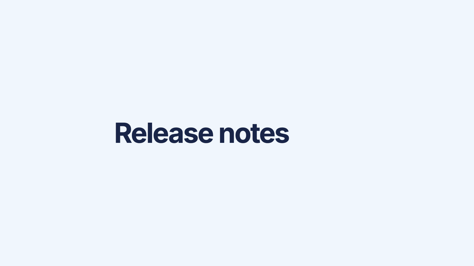

# Glimlet



One JavaScript file. Drop it on a page, no build.

`<glimlet-badge>` animates once when it scrolls into view, then stays put. It picks up the font of the surrounding line. With **reduced motion** on, it skips straight to the final badge.

Keep it for rare highlights: a release note, a new section. A page full of them stops reading as emphasis.

[Example](https://myhd.github.io/glimlet/)

## Use

```html
<script src="glimlet.js"></script>
<glimlet-badge>NEW</glimlet-badge>
```

Colors are optional:

```html
<glimlet-badge fill="oklch(0.86 0.055 300)" ink="#321452">BETA</glimlet-badge>
```

## Attributes

The label is the text between the tags.

| Attribute | Default | |
| --- | --- | --- |
| `fill` | `oklch(0.82 0.055 255)` | background |
| `ink` | `#192548` | text |
| `em` | `1.1` | height relative to the line |

## License

[MIT](LICENSE)
